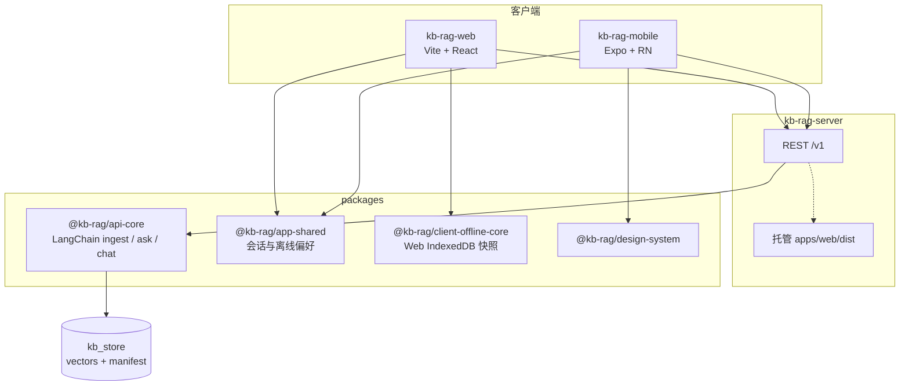

# 📚 KB RAG Local（kb-rag-local）

> **把 PDF 变成可对话的知识库**——LangChain 驱动的本地 RAG 流水线，可选火山方舟在线嵌入与对话，也支持服务端/端内离线闭环。

[](https://www.typescriptlang.org/)
[](https://pnpm.io/workspaces)
[](https://js.langchain.com/)
[](https://expressjs.com/)
[](package.json)

---

## 📋 项目概述

**一句话**：基于 **LangChain** 的 PDF 入库、向量检索与多轮对话；由 **Express** 暴露统一 `/v1` API，**Web（Vite + React）** 与 **React Native（Expo）** 共享一套业务与离线策略。

**核心价值**：

- ✨ **端到端 RAG**：切分、嵌入、检索、带引用回答——管线集中在 `@kb-rag/api-core`，CLI 与 HTTP 共用同一套逻辑。
- 🎯 **在线 / 离线可切换**：`AI_RUNTIME_MODE` / `RUNTIME_MODE` 可在方舟与「占位嵌入 + 可选本地 OpenAI 兼容对话」之间切换；Web/RN 支持知识库 bundle 同步后的端内检索与占位答复。
- 🚀 **单体可演示、Monorepo 可演进**：`kb_store` 本地落盘、同源托管 API + 前端产物、Docker Compose 一键拉起；复杂能力拆到 `packages/*` 便于复用与测试。

**适用场景**：技术文档 / 手册问答、内网知识库 PoC、离线演示与 Harness 验收、多端（Web + 移动）统一体验原型。

---

## 🏗️ 架构设计

### 设计理念

- **关注点分离**：`api-core` 只管 RAG 领域；`kb-rag-server` 负责 HTTP、限流、日志、静态资源与 CORS；`app-shared` / `client-offline-core` 承载多端一致的产品行为。
- **配置驱动**：方舟端点、检索阈值、会话持久化、上传上限等均由环境变量控制（见根目录 `.env.example`），避免把环境差异写死在代码里。
- **渐进式交付**：默认本地 `kb_store` 即可跑通；需要生产化时再叠网关、集中日志与 WAF（仓库内 `docs/PRODUCTION_SECURITY_V4.md` 提供清单）。

### 整体架构



**层次说明**：

| 层次 | 职责 | 关键位置 |
|------|------|----------|
| **入口与网关内逻辑** | 路由、`/healthz` / `/readyz`、上传、会话 API、同源静态站 | `apps/server/src/` |
| **RAG 内核** | PDF 解析、切块、嵌入、检索、CLI | `packages/api-core/src/` |
| **共享 UI / 离线** | 双模式聊天、连接自检、bundle 同步入口 | `packages/app-shared/`、`packages/client-offline-core/` |
| **数据面** | 向量与清单落盘、可选 `sessions/`、`kb_uploads/` | 仓库根 `kb_store/`、`sessions/`（见 `.gitignore`） |

### 核心数据流（在线 RAG）

```
PDF → 切分与嵌入 → 写入 kb_store
用户提问 → 向量检索 Top-K → 拼接上下文 → 对话模型 → 带引用/摘要的回答
```

多轮与上下文裁剪由 `ARK_CHAT_MAX_HISTORY_MESSAGES`、`ARK_RAG_CONTEXT_MAX_CHARS` 等约束（详见 `docs/KB_OPERATIONS.md`「多轮与裁剪」）。

---

## 🚀 快速开始

### 前置要求

| 依赖 | 说明 |
|------|------|
| **Node.js** | 建议 **≥ 20**（与 Docker 镜像阶段一致） |
| **pnpm** | 工作区安装与脚本执行 |
| **方舟（在线模式）** | 配置 `ARK_API_KEY` 等；离线模式可跳过 |

### 安装与运行（CLI 最小路径）

```bash
git clone <你的仓库 URL>
cd harness-langchain-knowledge-base

pnpm install
# 若出现 ERR_PNPM_IGNORED_BUILDS（esbuild 等）：pnpm approve-builds --all 后再 pnpm install

cp .env.example .env
# 按在线/离线需求编辑 .env（在线需填 ARK_*）

pnpm run build
# 可选验收：pnpm test（不要求配置 ARK_API_KEY）

# 将 PDF 放入 pdfs/ 后入库
pnpm ingest -- pdfs/某文件.pdf

# 单轮问答（需已有 kb_store/vectors.json）
pnpm ask -- "这份资料的核心结论是什么？"
```

### 双进程开发（API + Web）

```bash
# 终端 A：API（默认 8788，需 kb_store 与根 .env）
pnpm serve

# 终端 B：前端开发服务器（默认 5173，代理到 API）
pnpm dev:web
```

浏览器打开 `http://127.0.0.1:5173`。管理类操作（替换知识库、同步 bundle）需在 `apps/web/.env.local` 配置 `VITE_HTTP_ADMIN_TOKEN`，并与服务端 `HTTP_ADMIN_TOKEN` 一致。

### 单进程生产形态

```bash
pnpm run build && pnpm run build:web
pnpm serve
```

Express 先挂载 `/v1`，再托管 `apps/web/dist`，非 API 的 `GET` 回退到 `index.html`。

### 冒烟与 E2E

```bash
pnpm ingest:smoke    # 需 Python 3 + reportlab，见脚本说明
pnpm test:e2e:install && pnpm test:e2e   # 无 ARK_API_KEY 时部分用例 skip；CI 可 E2E_SKIP=1
```

---

## 📁 项目结构（节选）

```
harness-langchain-knowledge-base/
├── apps/
│   ├── server/          # kb-rag-server：Express、静态资源、Docker 入口
│   ├── web/             # kb-rag-web：Vite + React（详见 apps/web/README.md）
│   └── mobile/          # Expo RN（详见 apps/mobile/README.md）
├── packages/
│   ├── api-core/        # LangChain RAG 与 CLI（ingest / ask / chat）
│   ├── app-shared/      # 多端共享业务与离线偏好
│   ├── client-offline-core/  # Web 端离线存储与检索
│   ├── design-system/   # UI 组件与设计令牌
│   └── shared/          # 通用类型与工具
├── docs/                # API、运维与安全清单
├── pdfs/                # 待入库 PDF 放置区
├── kb_store/            # 向量与 manifest（运行时生成，勿提交密钥）
├── scripts/             # 冒烟、fixture、对比脚本等
└── README.md
```

---

## ✨ 主要功能

### 服务端 RAG 与运维

- PDF **入库**、**向量检索**、**单轮 ask** 与 **多轮 chat**（CLI + HTTP）。
- **会话 API**、可选 **会话落盘**（`ARK_SESSION_PERSIST=1` → `sessions/*.json`）。
- **就绪探针**（`/readyz` 读 manifest）、**限流**、**结构化日志**、**上传替换知识库**（需 Admin Token）。

### 多端体验

- **Web**：连接自检、流式/非流式对话、知识库替换、PWA 钩子（生产构建注册 SW）。
- **端内离线**：在线同步 `GET /v1/knowledge-base/bundle` 后，IndexedDB（Web）或 RN 本地存储中检索 + 占位回答；偏好持久化键前缀 `kb-rag-offline:v1`。

### 工程化

- **pnpm workspace** 分包构建与类型检查；根脚本聚合 **test / build / e2e**。
- **Docker Compose**：挂载 `kb_store`、`sessions`、`kb_uploads`；详见 `docs/PRODUCTION_SECURITY_V4.md`「阶段 Q」。

HTTP 契约见 **`docs/KB_API.md`**；换书、清库、端口与离线对照表见 **`docs/KB_OPERATIONS.md`**。

---

## ⚙️ 配置说明

完整说明与注释以 **`.env.example`** 为准。下表为最常见的几项：

| 变量 | 说明 |
|------|------|
| `ARK_API_KEY` / `ARK_CHAT_MODEL` / `ARK_EMBED_MODEL` | 火山方舟 OpenAI 兼容路径（在线模式） |
| `AI_RUNTIME_MODE` / `RUNTIME_MODE` | `online`（默认）或 `offline`（占位嵌入等） |
| `PORT` | HTTP 监听，默认 **8788** |
| `HTTP_ADMIN_TOKEN` | 管理接口 Bearer，与 Web `VITE_HTTP_ADMIN_TOKEN` 对齐 |
| `LOCAL_CHAT_BASE_URL` | 离线时可选：Ollama 等 OpenAI 兼容对话基址 |
| `HTTP_CORS_ORIGINS` | 生产/跨域白名单；开发默认允许本机 Vite |

Web 侧示例见 **`apps/web/.env.example`**；移动端见 **`apps/mobile/.env.example`**（勿把方舟密钥写入 `EXPO_PUBLIC_*`）。

---

## 👨‍💻 开发指南

- **类型检查**：`pnpm typecheck`（递归各包）。
- **测试**：`pnpm test`（`api-core`、`client-offline-core`、`app-shared` 等根脚本组合）。
- **提交信息**：建议 Conventional Commits（`feat:`、`fix:`、`docs:`、`refactor:` 等）。

更多前端细节、离线最短路径与端口冲突处理见 **`apps/web/README.md`**；原生构建见 **`apps/mobile/README.md`**。

---

## 🤝 贡献指南

1. Fork 本仓库并创建分支（如 `feature/your-topic`）。
2. 本地 `pnpm install` → `pnpm run build` → `pnpm test`（按改动范围选择）。
3. 提交 PR 时简述动机、风险与验证方式；避免将 `.env`、`sessions/*.json`、含密钥的 token 一并提交。

---

## 📄 许可证

根 `package.json` 标记为 **private**；仓库根目录**未包含** `LICENSE` 文件。若你计划对外开源，请自行补充许可证文本并在本段更新链接。

---

## 🙏 致谢

设计与实现受益于以下生态与产品：

- [LangChain.js](https://js.langchain.com/) 与 OpenAI 兼容抽象  
- [火山引擎方舟](https://www.volcengine.com/)（嵌入与对话接入）  
- [Express](https://expressjs.com/)、[Vite](https://vitejs.dev/)、[Expo](https://expo.dev/)

---

<p align="center">
若这份 README 帮你少踩一个坑，欢迎顺手点个 Star ⭐
</p>
